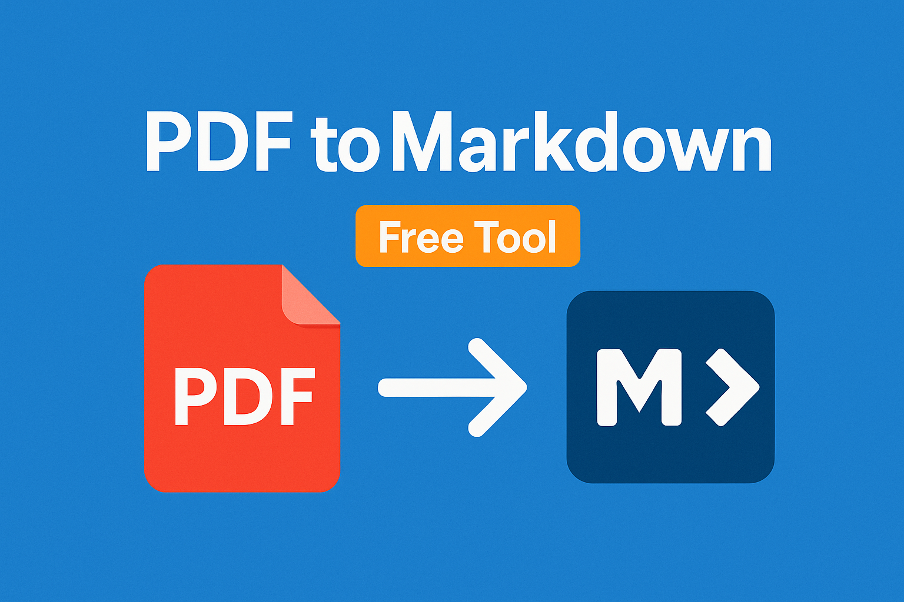

# PDF to Markdown Converter

Convert PDF files to Markdown instantly, securely, and 100% in your browser. No uploads, no privacy worries—just fast, accurate conversion.



---

## ⭐ Why Star This Project?
- 100% open source and free
- No file uploads—your data never leaves your device
- Fast, accurate, and easy to use
- Perfect for developers, writers, and anyone who works with Markdown

> **If you find this tool helpful, please consider starring the repo and sharing it!**

---

## 🚀 Features
- **Browser-based**: All processing happens locally in your browser
- **Privacy-first**: No files are uploaded or stored
- **Supports**: Headings, lists, tables, basic formatting, and more
- **Instant results**: Convert and download Markdown in seconds
- **Offline capable**: Works even without an internet connection
- **Open source**: Built with [@opendocsg/pdf2md](https://github.com/OpenDocSG/pdf2md)

---

## 🛠️ How It Works
1. **Upload your PDF**: Drag and drop or select a PDF file
2. **Conversion**: The app uses the `@opendocsg/pdf2md` library to extract text, structure, and formatting from your PDF
3. **Markdown Output**: The extracted content is converted to Markdown and displayed instantly
4. **Download or Copy**: Download the Markdown file or copy it to your clipboard

**All processing is done in your browser. Your files never leave your device.**

---

## ❓ FAQ

### How does the PDF to Markdown conversion work?
- The tool uses `@opendocsg/pdf2md` to extract text and structure from your PDF, then converts it to Markdown syntax. All processing is local—no uploads!

### What formatting is preserved?
- Headings, paragraphs, lists, tables, bold/italic text, and links (when possible).
- Complex layouts, images, and advanced formatting may not be fully preserved.

### Is my data secure?
- **Yes!** Everything happens in your browser. No data is uploaded or stored anywhere.

### Is there a file size limit?
- For best performance, keep files under 10MB. Larger files may slow down your browser.

### Can I use this tool offline?
- Yes! Once loaded, the app works without an internet connection.

### Which browsers are supported?
- All modern browsers: Chrome, Firefox, Edge, Safari, Opera.

---

## 🔒 Security & Privacy
- **100% browser-based**: No server-side processing
- **No uploads**: Your files never leave your device
- **No storage**: Nothing is saved after you close the tab

---

## 📦 Usage
1. Clone the repo:
   ```bash
   git clone https://github.com/mrmps/pdf2md
   cd pdf2md
   ```
2. Install dependencies:
   ```bash
   pnpm install
   ```
   or
   ```bash
   npm install
   ```
   or
   ```bash
   yarn install
   ```
3. Start the development server:
   ```bash
   pnpm dev
   ```
   or
   ```bash
   npm run dev
   ```
   or
   ```bash
   yarn dev
   ```
4. Open [http://localhost:3000](http://localhost:3000) in your browser

---

## 🤝 Contributing
Contributions are welcome! Please open issues or pull requests for improvements, bug fixes, or new features.

---

## 📄 License
MIT — see [LICENSE](LICENSE) for details.

---

## ⭐ Show Your Support
If you found this project useful, please **star the repo** and share it with others!

---

Made with ❤️ by Michael Ryaboy and the open-source community. 
